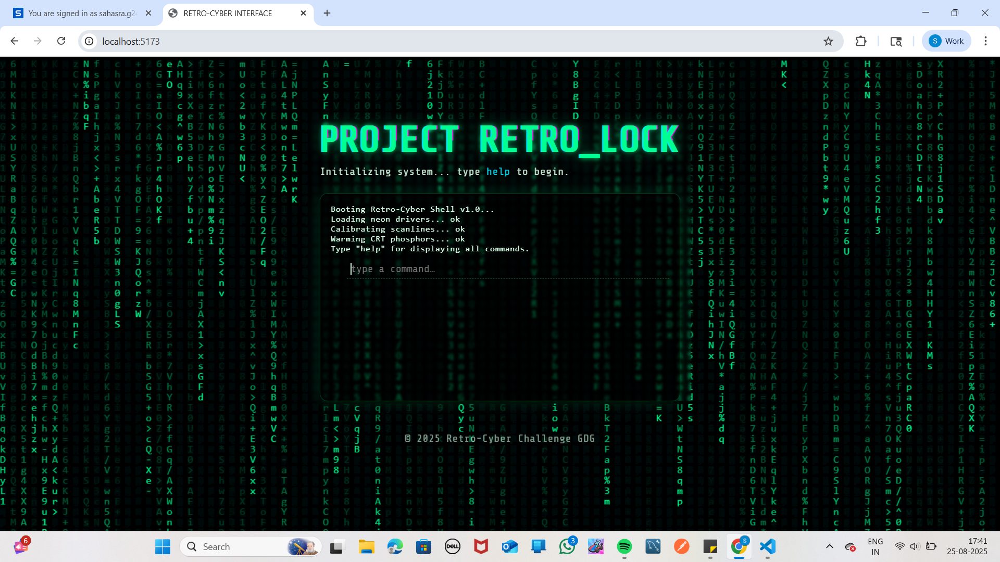
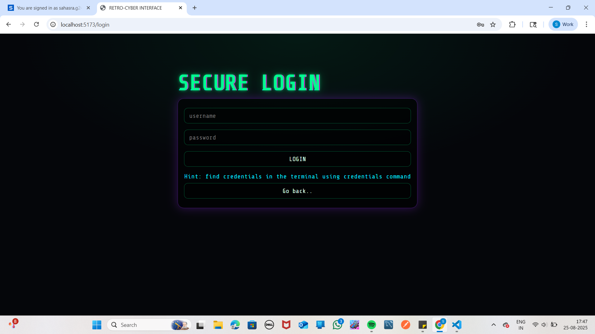
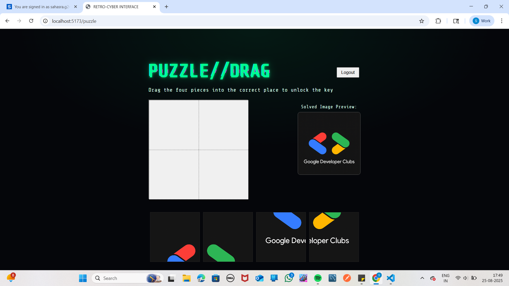
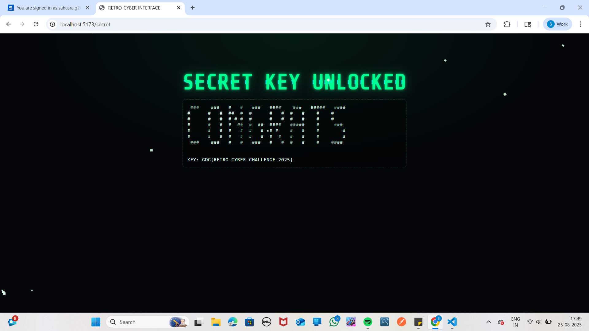

# GDG – Retro Cyber Challenge(Project Retro_Lock) 🔐🎮

## 🚀 Overview

This is a **terminal-style puzzle game** built as challenged by **Google Developer Groups**.  
The game runs in a simulated terminal(like 1990's) inside the browser, where players need to solve challenges and unlock a **secret key page** 🎉.

---

## 🏗️ Project Architecture

The project is divided into **client**(Frontend) and **server**(Backend):

---

## ⚡ Tech Stack

- **Frontend**: React + Vite
- **Backend**: Node.js + Express.js

---

## 🔑 Secret Key Flow

Click to view explanation

1. The user runs the app and gets a **terminal-like interface**.
2. User need to find correct login credentials and how to get login page.
3. When correct credentials entered, they are redirected to a puzzle.
4. Once solved, they are redirected to a **secret page**.
5. The secret page displays a **glitch animation with the unlocked key**.

---

## ⚙️ Setup Instructions

### 1️⃣ Clone Repository

git clone https://github.com/Sahasra-iiits/GDG---Retro-Cyber-Challenge-PROJECT-RETRO_LOCK-.git

cd gdg-project

### 2️⃣ Install Dependencies

**Client**:

cd client

npm install

npm run dev

**Server:**

cd server

npm install

npm start

---

## Screenshots

### Landing Page

### Login Page (Step 1)

### Puzzle Page (Step 2)

### Secret Key Page 

---

### Demo Video Link

[Click here to watch the video](https://youtu.be/xOKSdV54WvE?si=h6SRY2qkFxQsTBV9)

---

### 🎨 Features

Terminal-style UI

Puzzle solving (Drag and Drop Puzzle)

Secret page with glitch + ASCII art animations

Clean separation of frontend & backend

---

### Usage of AI
Used Ai tool(ChatGPT) to add animations in frontend to make it more attractive. Also used it for Authentication in backend. Took some help to create logic for puzzle.

### 🔮 Future Enhancements

Add a timer for puzzle completion

Add some more animations to make it attractive

---

### 👩‍💻 Contributor

[G. SAHASRA]
